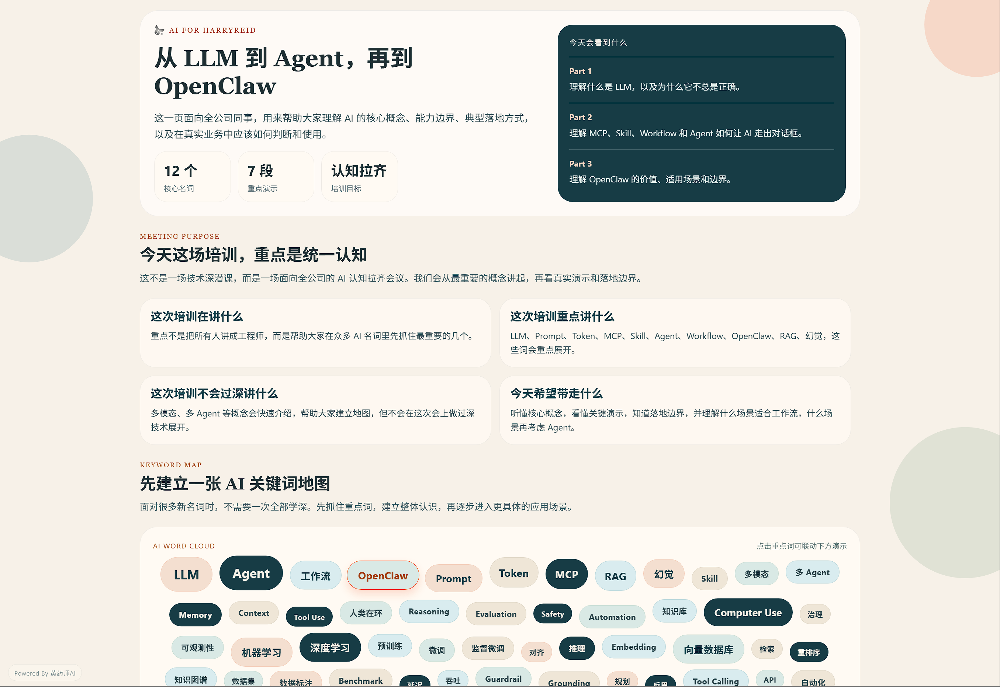

# AI培训大纲

面向公司内部培训与认知对齐的 AI 学习大纲项目。它围绕 `LLM -> Agent -> OpenClaw` 的主线设计培训页面，帮助同事先建立关键词地图，再理解典型能力、真实边界和落地方式，适合作为分享会、培训课和入门引导页。



## 项目亮点

- 把培训目标、范围边界和关键词地图浓缩到一套页面里
- 同时支持 `Web` 与 `App`，便于现场演示和移动端查看
- 页面表达偏培训导向，适合做内部宣讲、学习引导和认知统一
- 结构已经具备继续扩展课程目录、测试和学习路径的基础

## 技术方案

- Expo SDK 55
- React Native
- React Native Web

同一套代码可覆盖：

- Web 培训页面
- Android App
- iOS App

## 本地启动

### 安装依赖

```bash
npm install
```

### 启动 Web 版本

```bash
npm run web
```

### 启动 App 开发环境

```bash
npm run start
```

然后根据 Expo CLI 提示打开 Android、iOS 或 Web。

## 适用场景

- 公司内部 AI 培训开场页
- 面向业务同学的 AI 认知对齐材料
- 分享会现场的结构化提纲页面
- 后续扩展为课程体系、题库与学习追踪系统

## 后续可扩展方向

- 接入公司 Logo、课程封面和品牌化视觉资源
- 增加课程目录、章节跳转和学习路径设计
- 补充登录、学习进度、测试成绩和后台管理能力
- 串联真实 OpenClaw demo、录屏或知识库内容
